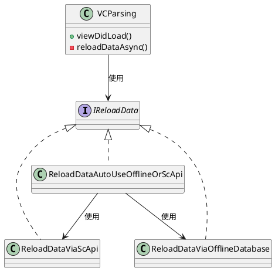

#  VCParsing

```plantuml
@startuml
' 定義介面
interface IReloadData {
}

' 定義實作介面的類
class ReloadDataAutoUseOfflineOrScApi implements IReloadData {    
}
class ReloadDataViaScApi implements IReloadData {
    
}
class ReloadDataViaOfflineDatabase implements IReloadData {
}

' 定義類別
class VCParsing {
    + viewDidLoad()
    - reloadDataAsync()
}

' 類與介面的關係
VCParsing --> IReloadData : 使用
ReloadDataAutoUseOfflineOrScApi --> ReloadDataViaScApi: 使用
ReloadDataAutoUseOfflineOrScApi --> ReloadDataViaOfflineDatabase: 使用

@enduml

```
